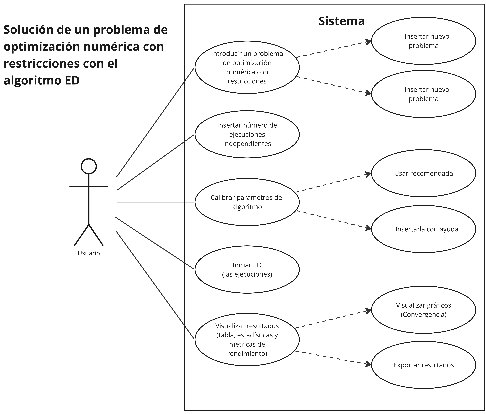

# Differential Evolution Framework

Evolución diferencial (**ED**) es un algoritmo basado en la selección elitista del individuo más apto y funciona para resolver problemas de optimización global.

En la codificación de este **framework** desarrollado en Java se aborda un algoritmo metaheurístico de evolución diferencial,
que gracias a la buena calibración o ajuste de sus parámetros, funciona para encontrar
una o un conjunto de soluciones a **problemas de optimización** de diversas áreas de
estudio. En la codificación del framework se
incluyen problemas de optimización de Ingeniería Mecánica y Química y el conjunto de problemas del **CEC 2006**.

Esta nueva herramienta tiene funcionalidades como: 

- Poder elegir y probar uno de los problemas de optimización integrados
- Poder calibrar los parámetros propios del algoritmo
- Permitir al usuario ingresar su propio problema a optimizar
- Analizar los resultados y las estadísticas básicas (mejor, media, mediana, desviación estándar, peor valor, tasa de factibilidad, tasa de éxito y rendimiento exitoso)

Los problemas de optimización que se pueden resolver son expresiones matemáticas que deben de cumplir con lo siguiente:

- Función objetivo
- Variables de diseño
- Restricciones
- Rango de variables
- Mejor valor conocido

**Un ejemplo de problemas de optimización es el siguiente:**

La representación del diagrama de casos de uso ilustra cómo los actores, es decir, los usuarios, intentan utilizar el algoritmo ED. El sistema, que cubre todos los casos de uso, permite resolver problemas de optimización numérica con restricciones capturándolos o seleccionando uno de los problemas ya codificados. Además, se proporcionan opciones para ingresar el número de ejecuciones y aceptar la calibración de parámetros predeterminada del algoritmo, o ingresar una calibración personalizada usando las herramientas del sistema. Una vez configurado, el usuario inicia el algoritmo, que se centra principalmente en el servicio de urgencias. El sistema proporciona una o más soluciones al usuario, junto con estadísticas básicas, métricas de rendimiento y gráficos de convergencia para su análisis. Los usuarios también tienen la opción de exportar los resultados si lo desean.

En el diagrama de secuencia se puede ver al usuario como el actor principal en el uso de framework, debido a que proporciona la información necesaria, como el problema a evaluar, la ejecución independiente a realizar y los parámetros del ED. Cada objeto se activa a través de mensajes, estos mensajes son líneas horizontales con flechas que muestran la comunicación entre objetos, mostrando la activación de cada objeto con barras verticales y sus interacciones y secuencia en el tiempo. 

Una de las ventajas de la programación orientada a objetos es la encapsulación de tareas en elementos llamados clases. La encapsulación permite agrupar datos y métodos que operan sobre esos datos en una única unidad, facilitando la modularidad y la gestión del código. Esto no solo mejora la organización del código, sino que también aumenta su legibilidad y facilita el mantenimiento y la evolución del software.

Las clases son una parte importante del desarrollo de la plataforma ED porque nos permiten reutilizar código. Al definir una clase, se pueden crear múltiples instancias de la misma, cada una con su propio estado, pero compartiendo el comportamiento definido en la clase. Esto promueve la reutilización del código, ya que los desarrolladores pueden utilizar clases existentes en nuevos contextos sin necesidad de duplicar esfuerzos.

